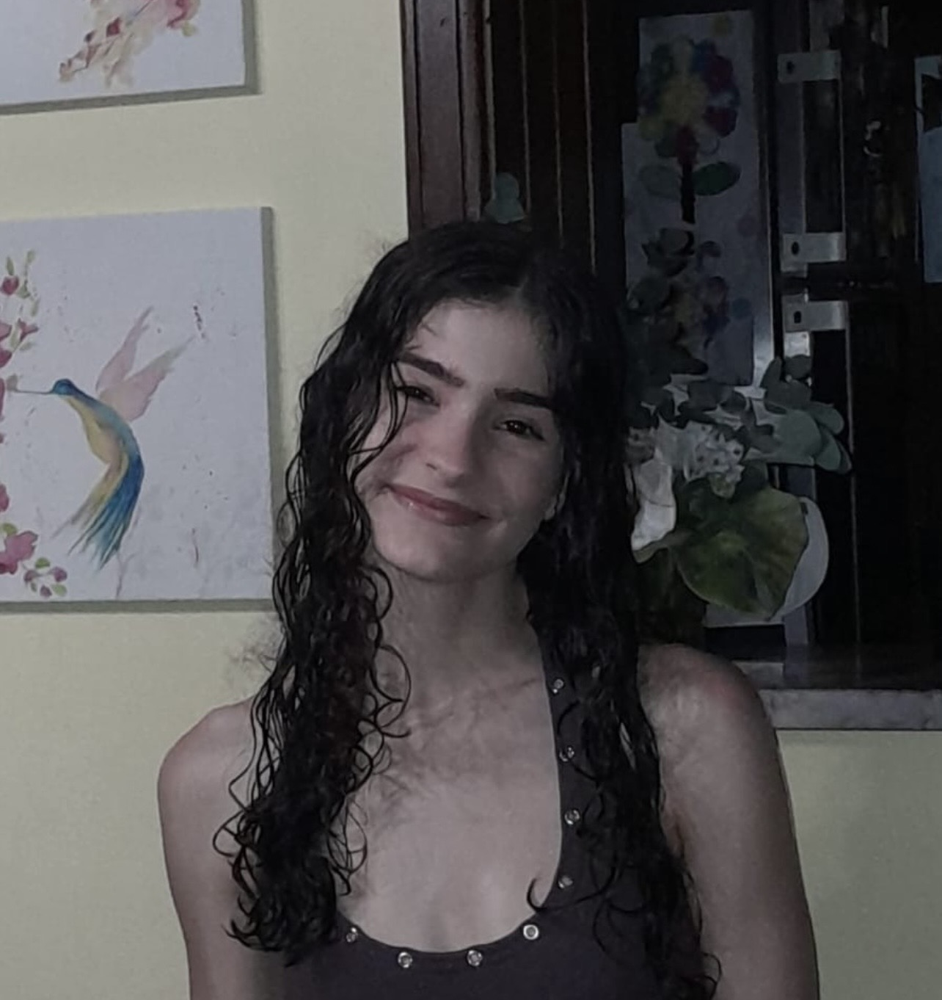

# Trabalho Prático de Casa 1 (TPC)

## Autor
* **Nome:** Mafalda Cerqueira da Silva
* **Número de aluno:** A114484
* **Foto:** 

## Resumo
Acabar o jogo do Maze nível 10

Fazer o desenho do barco no Turtle
## Lista de Resultados
**Maze nível 10:** https://blockly.games/maze?lang=en&level=10&&skin=0#mq6akm

**Desenho do Barco no Turtle:** https://blockly.games/turtle?lang=en&level=10#9j77aj

